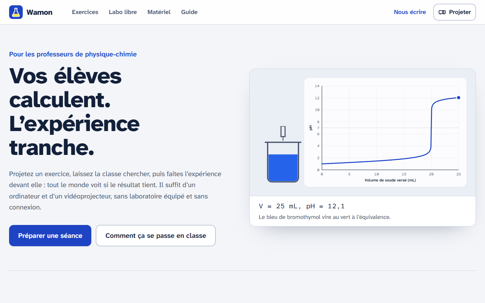
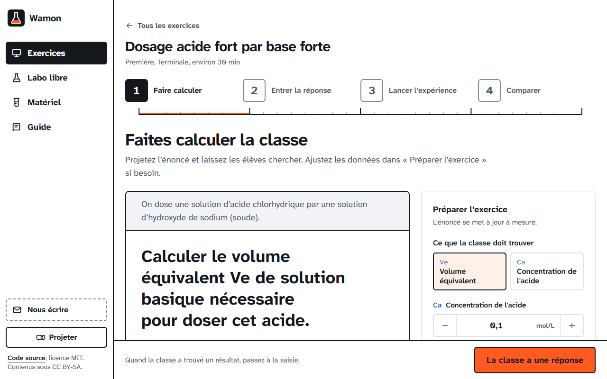
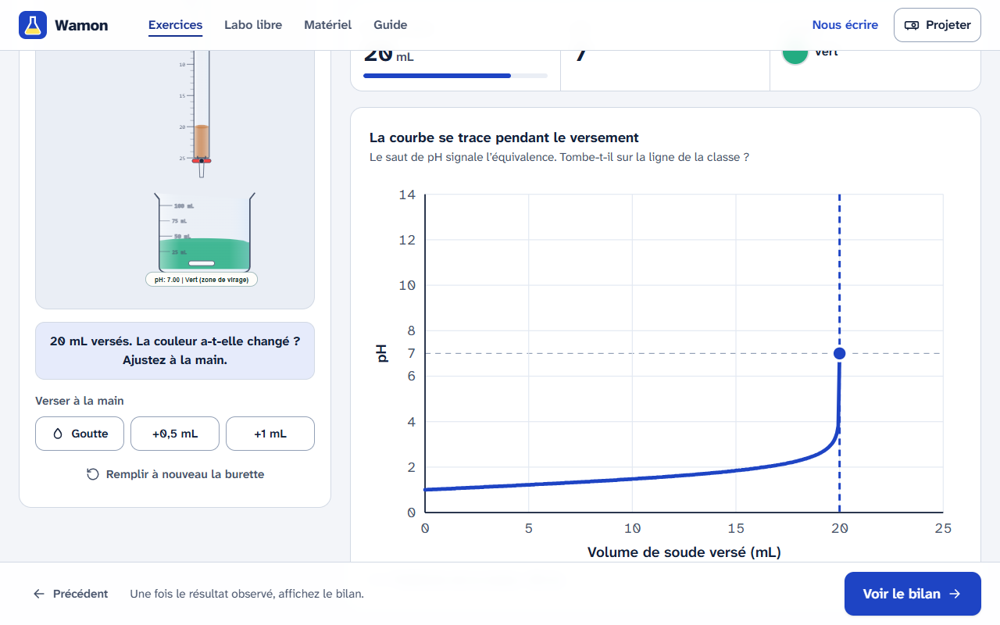
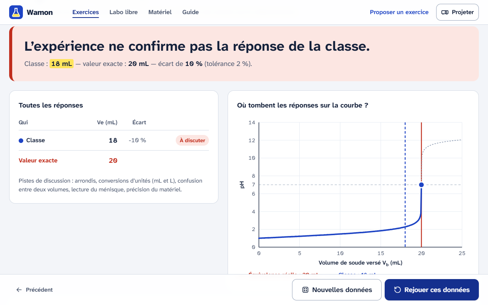
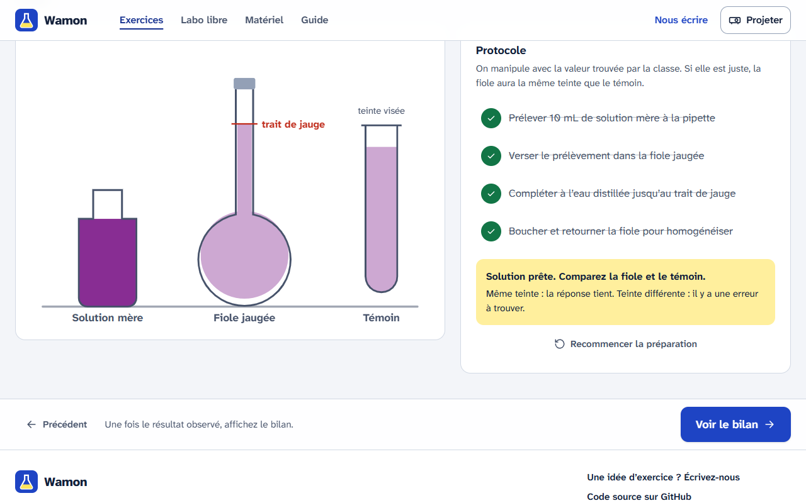
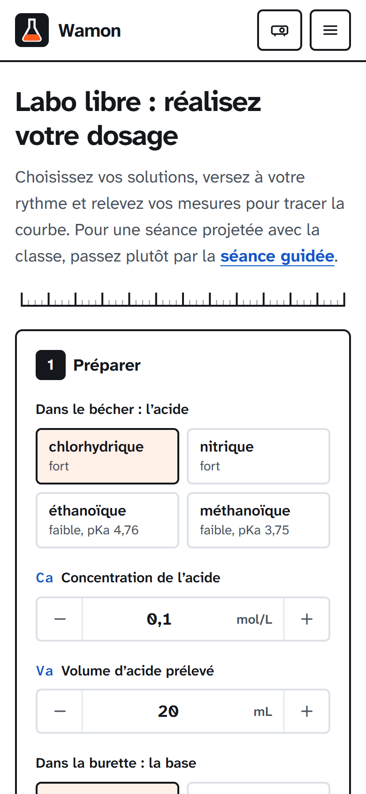

<div align="center">


# Wamon

**Le labo dans la classe.** Vos élèves calculent, l’expérience tranche.

[Utiliser Wamon](#utiliser-wamon) · [Proposer un exercice](#proposer-un-exercice-ou-nous-écrire) · [Contribuer au code](#contribuer-au-code) · [Documentation](docs/README.md)

</div>

Wamon est une application libre et gratuite pour les professeurs de physique-chimie du secondaire. Elle transforme un exercice du programme en expérience projetée : la classe calcule, le professeur saisit sa réponse, puis réalise l’expérience devant elle. Tout le monde voit si le résultat tient.

Elle est pensée pour les établissements où le matériel de laboratoire manque et où la connexion est fragile : un ordinateur et un vidéoprojecteur suffisent, et l’application fonctionne hors ligne une fois chargée.



## Ce que fait Wamon

### Une séance guidée en quatre temps

1. **Faire calculer** : l’énoncé est projeté comme une fiche de TP, lisible au fond de la salle. Le professeur règle les données ou les tire au hasard.
2. **Entrer la réponse** : la valeur trouvée par la classe, et celles des groupes s’ils ne sont pas d’accord.
3. **Lancer l’expérience** : on manipule avec la valeur de la classe. Le virage de l’indicateur arrive-t-il au bon volume ? La solution a-t-elle la teinte du témoin ?
4. **Comparer** : verdict, écart de chaque groupe, position des réponses sur la courbe et correction affichée seulement à la demande.

| Énoncé projeté | Expérience | Bilan |
| --- | --- | --- |
|  |  |  |

### Des exercices du programme

| Exercice | Niveau | La classe calcule | L’expérience montre |
| --- | --- | --- | --- |
| Préparer une solution par dissolution | Seconde | la masse à peser, ou la concentration obtenue | la teinte de la solution comparée à un témoin |
| Préparer une solution par dilution | Seconde | le volume à prélever, ou la concentration de la fille | la teinte de la solution comparée à un témoin |
| pH d’une solution d’acide chlorhydrique | Terminale | le pH, ou la concentration | la lecture du pH-mètre et la teinte de l’indicateur universel |
| pH d’une solution d’hydroxyde de sodium | Terminale | le pH, ou la concentration | la lecture du pH-mètre, avec le piège pOH / pH |
| pH d’une solution d’acide éthanoïque | Terminale | le pH, la concentration, ou la concentration en ions éthanoate | un acide faible est bien moins acide qu’un acide fort de même concentration |
| Dosage acide fort / base forte | Première, terminale | le volume équivalent, ou la concentration de l’acide | le virage de l’indicateur et la courbe de pH |
| Dosage de l’acide éthanoïque | Terminale | le volume équivalent, ou la concentration de l’acide | la courbe d’un acide faible, la demi-équivalence, le choix de l’indicateur |
| Dosage de l’ammoniac | Terminale | le volume équivalent, ou la concentration de l’ammoniac | la courbe d’une base faible dosée par un acide fort, l’équivalence en milieu acide |

Les exercices de terminale suivent le guide du programme d’études par compétences de la classe de Terminale D du Bénin (situation d’apprentissage 2, chimie des solutions aqueuses).



### Et aussi

- **Un labo libre** pour les élèves, y compris sur téléphone : choix de l’acide (fort ou faible), de la base, des concentrations et de l’indicateur, versement goutte à goutte, relevé des mesures, courbe construite par l’élève.

  

- **Un mode projection** qui agrandit toute l’interface et masque les réglages.
- **Un catalogue du matériel** : une fiche par instrument, avec le bon geste et les erreurs fréquentes.
- **Une adresse par écran** : le bouton « retour » du navigateur revient à l’étape précédente sans rien perdre.

## Utiliser Wamon

Aucune installation n’est nécessaire pour les professeurs : ouvrez l’adresse du site dans un navigateur récent (Chrome, Edge, Firefox ou Safari). Après une première visite, Wamon fonctionne sans connexion.

Le [guide pour la classe](docs/enseignants/utiliser-wamon-en-classe.md) explique comment préparer et mener une séance.

## Proposer un exercice ou nous écrire

Vous avez un exercice qui marche bien avec vos élèves, une question ou une remarque ? Écrivez à **vianneyhoueho@gmail.com**. Décrivez l’exercice comme un sujet de TP : énoncé, données, réponse attendue, correction et ce que la classe doit voir. L’équipe le transforme en expérience, le fait relire par d’autres professeurs et vous prévient quand il est en ligne.

## Contribuer au code

### Démarrer

Prérequis : Node.js 20.19 ou plus récent, npm et Git.

```bash
git clone https://github.com/Gecnos/wamon.git
cd wamon
npm install
npm run dev
```

| Commande | Rôle |
| --- | --- |
| `npm run dev` | Serveur de développement avec rechargement à chaud |
| `npm test` | Tests (modèles scientifiques, exercices, catalogue) |
| `npm run build` | Vérification TypeScript et build de production dans `dist/` |
| `npm run preview` | Sert le build pour le tester, service worker compris |

### Technologies

React 18, React Router 7 (`HashRouter`, compatible hors ligne et hébergement statique), Tailwind CSS 4, TypeScript, Vite 6 et Vitest 3. Les polices Atkinson Hyperlegible sont embarquées dans le build.

### Où commencer

- [Architecture du code](docs/developpeurs/architecture.md)
- [Ajouter un exercice](docs/developpeurs/ajouter-un-exercice.md), à partir d’une proposition reçue par e-mail
- [Principes de design](docs/developpeurs/design.md) : lisibilité en projection, mobile, Tailwind uniquement
- [Déploiement](docs/developpeurs/deploiement.md) (Cloudflare Workers)

Les tickets marqués [`bon premier ticket`](https://github.com/Gecnos/wamon/labels/bon%20premier%20ticket) sont un bon point d’entrée. Lisez [CONTRIBUTING.md](CONTRIBUTING.md) avant d’ouvrir une pull request.

## Licences

- Code : [MIT](LICENSE).
- Contenus pédagogiques (énoncés, fiches de matériel, corrections) : [CC BY-SA 4.0](https://creativecommons.org/licenses/by-sa/4.0/deed.fr).

Merci de citer les sources des énoncés et des données que vous adaptez.

## Code de conduite

Wamon réunit des professeurs, des élèves et des développeurs. Chacun s’engage à respecter le [code de conduite](CODE_OF_CONDUCT.md).
